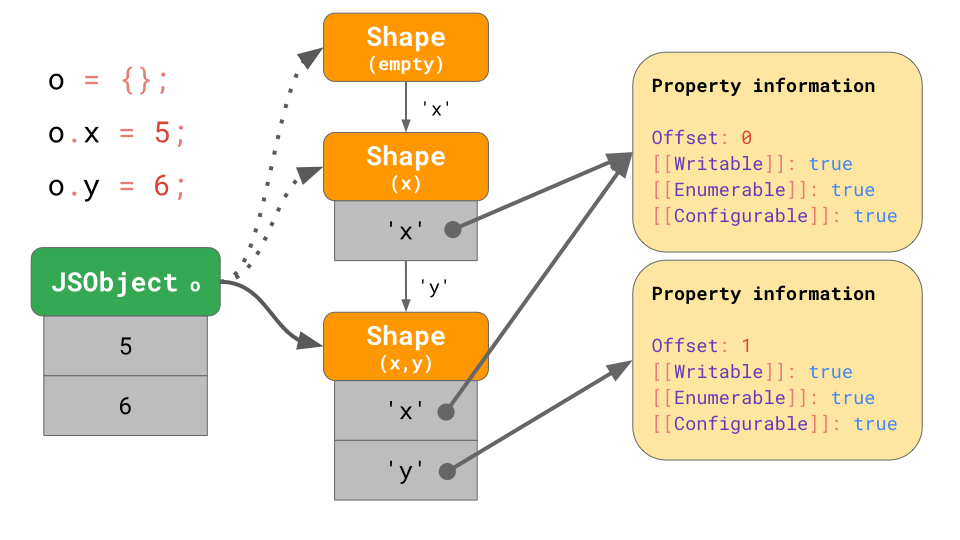
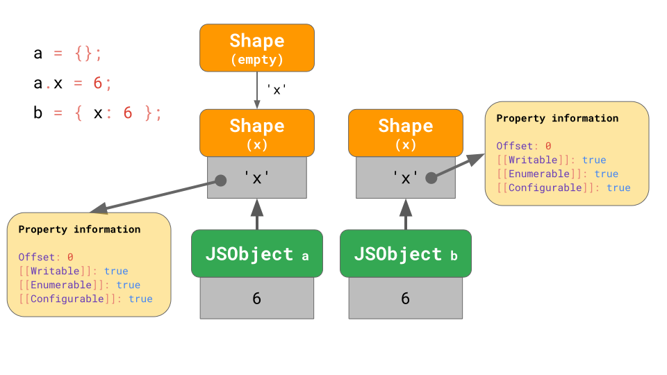
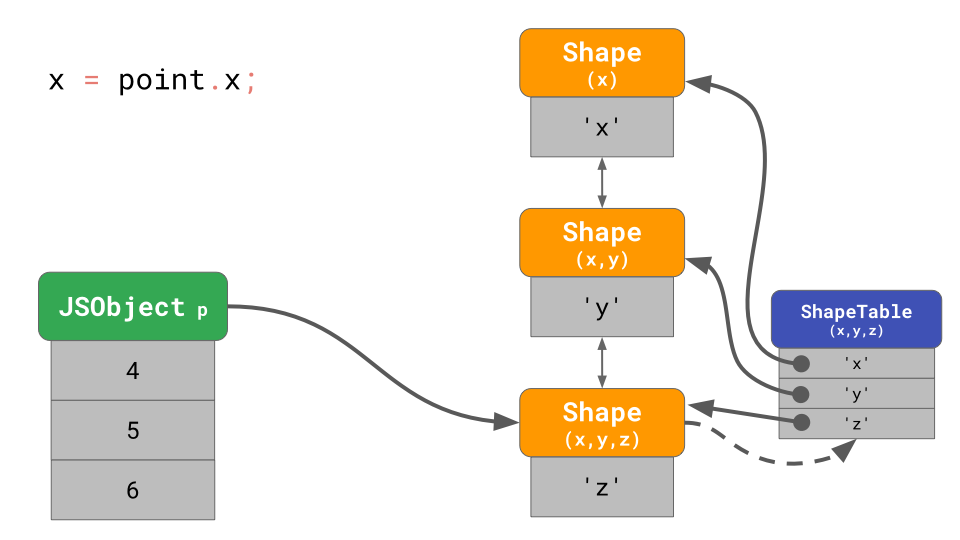

# learn-js-engine
记录自己学习JavaScript引擎的一些知识总结

> 主要是关于v8的内容，后续可能会涉及到v8和其他引擎之间的对比

## 配置v8的调试工具d8
这里，由于国内不可描述的原因，从下载源码自己编译出一个`d8`比较困难，所以直接使用已经编译好的`d8`工具。

### 1. 获取当前最新的v8版本
```
https://storage.googleapis.com/chromium-v8/official/canary/v8-mac64-dbg-latest.json
==>
{"version": "8.4.144"}
```


### 2. 下载对应平台的`d8`
```
mac平台:
https://storage.googleapis.com/chromium-v8/official/canary/v8-mac64-dbg-${version}.zip

linux32平台:
https://storage.googleapis.com/chromium-v8/official/canary/v8-linux32-dbg-${version}.zip

linux64平台:
https://storage.googleapis.com/chromium-v8/official/canary/v8-linux64-dbg-${version}.zip

win32平台:
https://storage.googleapis.com/chromium-v8/official/canary/v8-win32-dbg-${version}.zip

win64平台:
https://storage.googleapis.com/chromium-v8/official/canary/v8-win64-dbg-${version}.zip
```

比如，我要下载`mac`平台的`d8`，直接浏览器访问`https://storage.googleapis.com/chromium-v8/official/canary/v8-mac64-dbg-8.4.144.zip`，
就可以下载到`v8.4.144`这个版本的`d8`了。
> storage.googleapis.com 这个域名在国内是可以直接访问的。

### 3. 使用d8输出一些信息
> 我已经下载好了一个v8.4.144的工具，放在了v8-dbg下面，里面有一个可执行文件d8。

```shell script
$ ./v8-dbg/d8 demo.js --print-bytecode
...
[generated bytecode for function: foo (0x2ada0824fe61 <SharedFunctionInfo foo>)]
Parameter count 3
Register count 0
Frame size 0
         0x2ada0825000e @    0 : 25 02             Ldar a1
         0x2ada08250010 @    2 : 34 03 00          Add a0, [0]
         0x2ada08250013 @    5 : aa                Return 
Constant pool (size = 0)
Handler Table (size = 0)
Source Position Table (size = 0)
```
可以看到我们的`foo`函数对应的字节码。

## 优质文章

1. [JavaScript engine fundamentals: Shapes and Inline Caches](https://mathiasbynens.be/notes/shapes-ics)
2. [JavaScript engine fundamentals: optimizing prototypes](https://mathiasbynens.be/notes/prototypes)
3. [Javascript Hidden Classes and Inline Caching in V8](https://richardartoul.github.io/jekyll/update/2015/04/26/hidden-classes.html)
4. [Optimizing dynamic JavaScript with inline caches](https://github.com/sq/JSIL/wiki/Optimizing-dynamic-JavaScript-with-inline-caches)
5. [JavaScript Engines Hidden Classes](https://draft.li/blog/2016/12/22/javascript-engines-hidden-classes/)
6. [How JavaScript works: inside the V8 engine + 5 tips on how to write optimized code](https://blog.sessionstack.com/how-javascript-works-inside-the-v8-engine-5-tips-on-how-to-write-optimized-code-ac089e62b12e)
7. [Fast Property Access](https://chromium.googlesource.com/external/github.com/v8/v8.wiki/+/60dc23b22b18adc6a8902bd9693e386a3748040a/Design-Elements.md)
8. [How JavaScript works: inside the V8 engine + 5 tips on how to write optimized code](https://blog.sessionstack.com/how-javascript-works-inside-the-v8-engine-5-tips-on-how-to-write-optimized-code-ac089e62b12e)
9. [V8 hidden class and inline cache](https://www.slideshare.net/prodromouf/v8-hidden-class-and-inline-cache)
10. [V8 internals](https://v8.dev/blog/tags/internals)


## JavaScript的对象模型(Object Modal)
根据 `ECMAScript` 规范的定义，`JavaScript`中的对象模型为一个字典结构，通过字符串的属性名引用`Property Attribute`对象，如下图所示：


> 我们可以通过 `Object.getOwnPropertyDescriptor` 这个api访问到对应的`Property Attribute`对象

数组其实是一类特殊的对象，只不过数组会对索引进行特殊的处理。


> 注意：数组的索引有一个最大限额，为`2**32 - 1`个，也就是说，数组的索引范围为`0 ~ 2**32-2`，如果超过这个范围，则多出来的索引退化为普通对象的存储模式。


### 对象模型在内存中的存储

#### 1. shape
首先，我们做出如下假设：
1. JavaScript程序中会有很多的对象拥有相同的属性，我们称这些对象有相同的形状(`shape`)
2. 访问具有相同形状的对象的同一个属性也很普遍

比如，
```js
function logX(object) {
    console.log(object.x);
}

const object1 = { x: 1, y: 2 };
const object2 = { x: 3, y: 4 };

logX(object1);
logX(object2);
```

首先，作为字典，我们会如何存储`JavaScript`对象呢？

(此处应该有配图)

如上图所示，我们把`property name`和`property attribute`都存储在`JSObject`中

这样存储的优点就是简单，缺点就是太浪费内存，因为相同`shape`的对象有相同的`property name`和`property attribute`，而我们却在每个对象上都存了一份，导致冗余。

因此，一个更节省内存的存储方式也就显而易见了，我们提取出一个`shape`对象，用来存储`property name`，并且这些`property name`指向的不再是`property attribute`，
而是类似的`property information`，唯一的区别就是`[[value]]`用`offset`替代，我们的`[[value]]`实际存储在`JSObject`中，把偏移保存在`property
 information`中。
如下图所示:


这样存储之后，具有相同`shape`的`JSObject`会指向同一个`shape`对象，这样，相同的`property name`和`property attribute`只会保存一份。
如下图所示:

可以看出来，这种存储方式极大节省了内存。

#### 2. transition chains and trees
假设现在有一个`JSObject`对象，它有一个对应的`Shape`对象，我们给这个`JSObject`动态添加一个属性，那么这个`JSObject`对象的`Shape`对象会
发生什么呢？

这里不卖关子了，当我们动态添加属性之后，对应的`shape`对象会过渡到一个新的`shape`对象，如下图所示:


为了进一步节省内存，每一个`shape`只包含它所引入的`property`，如下图所示:

这样，通过链表的方式把所有的`shape`链接起来

不同的书写方式，会导致不同的`shape chain or shape tree`，比如:
```js
const object1 = {};
object1.x = 5;
const object2 = {};
object2.y = 6;
```
对应的`shape`如下:


```js
const object1 = {};
object1.x = 5;
const object2 = { x: 6 };
```
对应的`shape`如下:



下面，我们实战一下

假设我们有如下代码:
```js
const point = {};
point.x = 4;
point.y = 5;
point.z = 6;
```

其对应的`shape chain`如下:


假设我们现在要访问`x`属性，比如程序中写了`console.log(point.x)`，`JavaScript`引擎需要从`shape chain`的最底部开始，顺着链表往上查找。
知道找到引入`x`属性的`shape`，然后获取其`offset`

如果我们频繁的这样查找，效率其实是很低的，尤其当我们的`JSObject`对象中的属性变多之后，这个查找速度是`O(n)`，`n`是我们`JSObject`对象中的属性个数。

为了加快这个查找速度，`JavaScript`引擎引入了`ShapeTable`这个数据结构。这个`ShapeTable`是一个字典，用来在`property name`和引入该`property name`的`shape`对象之间建立映射。
如下图所示:

(这里其实是说，`map`的访问速度比`linked list`快)

这里我们又回到了`字典`这种数据结构了。我们在添加`shape`之前本就是`字典`这种数据结构，为何我们还要绕一大圈呢？

其实，我们主要是为了解决2个问题:
1. 减少冗余数据的存储
2. 加快对象属性的访问速度

我们引入`shape`之后，的确是减少了冗余的`property name`和`property attribute`的存储，具有相同`shape`的`JSObject`只会存一份数据，
但是对于对象属性的访问速度，由于我们又回到了原点(字典数据结构)，因此并没有什么提升。

但是，我们基于`shape`的概念，出现了另一个技术`Inline Caches`，可以极大提升对象属性的访问速度。


#### Inline Caches (ICs)

