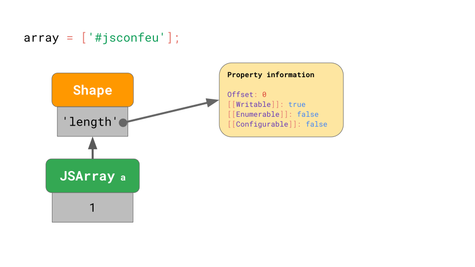

# JavaScript engine fundamentals: Shapes and Inline Caches

## JavaScript的对象模型(Object Modal)
根据 `ECMAScript` 规范的定义，`JavaScript`中的对象模型为一个字典结构，通过字符串的属性名引用`Property Attribute`对象，如下图所示：


> 我们可以通过 `Object.getOwnPropertyDescriptor` 这个api访问到对应的`Property Attribute`对象

数组其实是一类特殊的对象，只不过数组会对索引进行特殊的处理。


> 注意：数组的索引有一个最大限额，为`2**32 - 1`个，也就是说，数组的索引范围为`0 ~ 2**32-2`，如果超过这个范围，则多出来的索引退化为普通对象的存储模式。


### 对象模型在内存中的存储

#### 1. shape
首先，我们做出如下假设：
1. JavaScript程序中会有很多的对象拥有相同的属性，我们称这些对象有相同的形状(`shape`)
2. 访问具有相同形状的对象的同一个属性也很普遍

比如，
```js
function logX(object) {
    console.log(object.x);
}

const object1 = { x: 1, y: 2 };
const object2 = { x: 3, y: 4 };

logX(object1);
logX(object2);
```

首先，作为字典，我们会如何存储`JavaScript`对象呢？

(此处应该有配图)

如上图所示，我们把`property name`和`property attribute`都存储在`JSObject`中

这样存储的优点就是简单，缺点就是太浪费内存，因为相同`shape`的对象有相同的`property name`和`property attribute`，而我们却在每个对象上都存了一份，导致冗余。

因此，一个更节省内存的存储方式也就显而易见了，我们提取出一个`shape`对象，用来存储`property name`，并且这些`property name`指向的不再是`property attribute`，
而是类似的`property information`，唯一的区别就是`[[value]]`用`offset`替代，我们的`[[value]]`实际存储在`JSObject`中，把偏移保存在`property
 information`中。
如下图所示:


这样存储之后，具有相同`shape`的`JSObject`会指向同一个`shape`对象，这样，相同的`property name`和`property attribute`只会保存一份。
如下图所示:

可以看出来，这种存储方式极大节省了内存。

#### 2. transition chains and trees
假设现在有一个`JSObject`对象，它有一个对应的`Shape`对象，我们给这个`JSObject`动态添加一个属性，那么这个`JSObject`对象的`Shape`对象会
发生什么呢？

这里不卖关子了，当我们动态添加属性之后，对应的`shape`对象会过渡到一个新的`shape`对象，如下图所示:


为了进一步节省内存，每一个`shape`只包含它所引入的`property`，如下图所示:

这样，通过链表的方式把所有的`shape`链接起来

不同的书写方式，会导致不同的`shape chain or shape tree`，比如:
```js
const object1 = {};
object1.x = 5;
const object2 = {};
object2.y = 6;
```
对应的`shape`如下:


```js
const object1 = {};
object1.x = 5;
const object2 = { x: 6 };
```
对应的`shape`如下:


下面，我们实战一下

假设我们有如下代码:
```js
const point = {};
point.x = 4;
point.y = 5;
point.z = 6;
```

其对应的`shape chain`如下:


假设我们现在要访问`x`属性，比如程序中写了`x = point.x;`，`JavaScript`引擎需要从`shape chain`的最底部开始，顺着链表往上查找。
直到找到引入`x`属性的`shape`，然后获取其`offset`

如果我们频繁的这样查找，效率其实是很低的，尤其当我们的`JSObject`对象中的属性变多之后，这个查找速度是`O(n)`，`n`是我们`JSObject`对象中的属性个数。

为了加快这个查找速度，`JavaScript`引擎引入了`ShapeTable`这个数据结构。这个`ShapeTable`是一个字典，用来在`property name`和引入该`property name`的`shape`对象之间建立映射。
如下图所示:

(这里其实是说，`map`的访问速度比`linked list`快)

这里我们又回到了`字典`这种数据结构了。我们在添加`shape`之前本就是`字典`这种数据结构，为何我们还要绕一大圈呢？

其实，我们主要是为了解决2个问题:
1. 减少冗余数据的存储
2. 加快对象属性的访问速度

我们引入`shape`之后，的确是减少了冗余的`property name`和`property attribute`的存储，具有相同`shape`的`JSObject`只会存一份数据，
但是对于对象属性的访问速度，由于我们又回到了原点(字典数据结构)，因此并没有什么提升。

但是，我们基于`shape`的概念，出现了另一个技术`Inline Caches`，可以极大提升对象属性的访问速度。


#### Inline Caches (ICs)

假设我们有这样一段代码:
```js
// 用来加载对象o的属性x
function getX(o) {
  return o.x;
}
```

如果用`JSC`运行这个函数的话，生成的字节码如下:

第一条指令`get_by_id`从第一个参数(`arg1`)中加载属性`x`，并存储在`loc0`中。
第二条指令返回这个`loc0`。

如上图所示，`JSC`嵌入了一个`IC`到`get_by_id`这条指令中，这个`IC`由2个未初始化的插槽(`slot`)组成。

现在，假设我们调用这个函数的参数对象是`{ x: 'a' }`，如下图所示:


我们前面已经分析过了，这个对象有一个带`x`属性的`shape`对象，`shape`对象内部存储了`x`的偏移。
当你第一次执行这个函数的时候，`get_by_id`指令会去查找属性`x`(沿着`shape linked list`或者`ShapeTable`查找)，最终找到这个属性的偏移是0。

这时候，内嵌到`get_by_id`指令里面的这个`IC`就会缓存这个结果，第一个插槽指向参数对应的`shape`对象，第二个插槽保存对应属性的偏移值。
如下图所示:


该函数后续的调用，`IC`只需要比较参数的`shape`是否发生了变化，如果没有变化，直接就可以根据缓存的偏移值去`JSObject`中加载值了。
如下图所示:

这样就可以避免掉昂贵的`property information`的搜索过程了。(图中的灰色)


### 高效存储数组

数组，我们前面已经说过了，是一种特殊的对象。特殊在哪里呢？数组的`property name`都是数字，我们称之为`array indics`，就是数组索引。
如果我们保存数组的每一个元素的`property attribute`的话，将是一笔不小的开销。

考虑下面这段代码:
```js
const array = [
    '#jsconfeu',
];
```

引擎在数组对象中存储`length`属性的值(1)，并指向它的`shape`对象，该`shape`对象和普通`JSObject`对象的`shape`并无区别。
如下图所示:


这和我们前面分析对象时差不多，但是，数组的元素值存储在哪呢？

如下图所示:


每一个数组都会有一个单独的`elements backing store`，这个地方用来存储数组的所有**索引属性值**。
还记得之前我们说过，数组的最大索引值为`2**32-2`，超过这个索引的元素值，将不会再存储在这个地方了。

`JavaScript`引擎不需要为这里面的每一个元素保存单独的`property attribute`数据，因为通常数组的所有元素都是可写、可枚举、可配置的。
也就是说，通常我们只需要为整个数组保存一个`property attribute`就可以了。

凡事都有例外，如果你非要修改一个数组元素的`property attribute`，那又会发生什么呢？
```js
// Please don't ever do this!
const array = Object.defineProperty(
    [],
    '0',
    {
        value: 'Oh noes!!',
        writable: false,
        enumerable: false,
        configurable: false,    
    }
);
```
上面这段代码给一个空数组定义了一个属性`'0'`，这个`'0'`正好也是一个数组索引值，但是却给它设置了一个非默认的`property attribute`。

在这种极端情况下，`JavaScript`引擎将会把**整个**`elements backing store`作为一个字典存储，字典的`key`是数组的索引值，`value`是这个元素
的`property attribute`对象。
如下图所示:


即便数组中只有一个元素是这种非默认的`property attribute`，整个数组的`backing store`也都会回退到这种低速且低效的字典模式。

因此，一定一定要避免在**数组索引上**使用`Object.defineProperty`。


### 总结
我们了解了`JavaScript`引擎是如何存储对象和数组的，以及`Shapes`和`ICs`是如何用来优化对象的常见操作的。
基于这些知识，我们可以识别出一些`JavaScript`编码的最佳实践，来帮助提升性能:

1. 总是用同样的方式初始化对象，以便他们可以有相同的`shape`。
2. 不要在数组元素上搞`property attribute`，以便他们可以高效存储和操作。 
